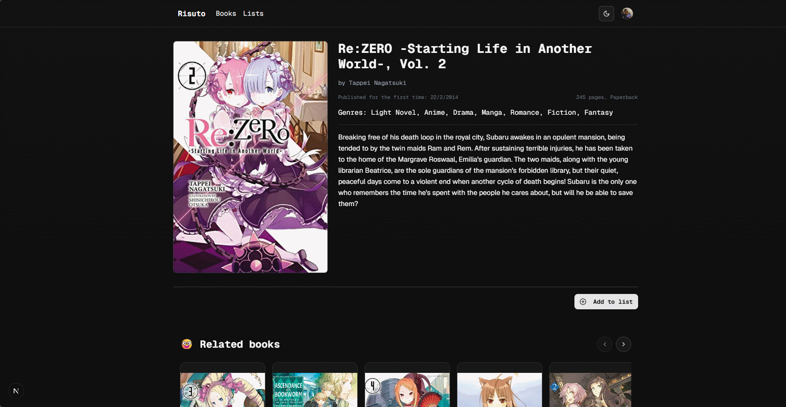

Risuto

# 📚 Risuto

**Risuto** es una app web para crear y compartir tus listas de lectura de novelas, historias, mangas y mucho más.
¿Listas privadas? ¡Invita hasta a 5 amigos y compartan sus libros y opiniones! 

---

## 🔍 Descripción del proyecto

Esta app te permite:

- **Explorar** más de 15 000 libros (novelas, manga, etc.) 🤯.
- **Crear** hasta 100 listas de lectura por usuario 📋.
  - Listas **públicas** (cualquiera puede verlas, comentar y dar “like”) 📢.
  - Listas **privadas** 🔐. 
    - Se crea automáticamente una **organización** en Clerk por cada lista privada. 🦸🏿‍♂️
    - Invitar hasta 5 miembros mediante enlaces enviados por correo. 👯‍♂️
    - Rol de **admin** : Agregar, leer, editar y eliminar libros  completo + gestión de miembros. 👨🏿‍💻
    - Rol de **member**: solo podrá añadir y ver libros en la lista.🧑🏿‍🦽
- **Comentar** en cada lista y en cada libro de la lista, no hace falta que tengas una sesión para comentar.🎬
- **Dar “like”** podrás dar like a las listas que más te gustan y ver quien ha dado like a las listas 👀 
- Ver listas que te han **compartido** o a las que has dado **“like”**. 👋
- Cuando visites un libro, podrás ver **libros relacionados** con tu vista actual 🤓. 

---

## 🌐 Enlace a la demo

[👉 Ver demo en vivo - Risuto :point_left:](https://www.risuto.info/)  
[👉Repositorio de código - Risuto :point_left:](https://github.com/jul-cesar/Risuto)

---

## 📸 Capturas de pantalla / GIFs

*Pantalla principal con listado de libros*

---

  
*GIF: creación de una lista privada y añadir mivembros*

---

  
*Vista de detalle con comentarios y likes*

---

*Agregar libros a una lista*

---

## 🔐 Integración con Clerk

Clerk se utiliza para manejar **usuarios**, **registro**, **login**, **protección de rutas** y **roles/organizaciones**:

1. **Registro & Login**  
   - Componentes de Clerk para UI de autenticación.
   - Redirección automática tras login/logout.
   - **Middleware** de Next.js que protege las rutas privadas y lee la sesión de Clerk.

2. **Webhooks**  
   - URL de webhook en `src/app/api/webhooks/`.
   - Capturamos el evento `user.created` que emite **Clerk** para guardar al usuario en nuestra base de datos (Prisma).

3. **Organizaciones dinámicas**  
   - Al crear una “lista privada”:
     - Creamos una organización en Clerk (`clerk.organizations.createOrganization({...})`).
     - Asociamos `org.id` a la lista en nuestra BD.
   - **Invitaciones**:
     - Envío de invitaciones a través del correo electrónico usando el **SDK de Clerk**
     - Al aceptar la invitación a una lista privada, el **middleware** y ruta `src/app/accept-invitation/[[..rest]]` redirige al usuario a `/lists/[slug]` y se valida su membresía para agregarlo a la **organización** como un miembro más.
    - **Ingreso a lista privada** 
      - Mediante el uso del **SDK de Clerk** y el **middleware** se validará si un usuario tiene una **invitación** o pertenece a la **organización** para poder ver la lista privada. 
    - **Vista de organizaciones** 
      - Cada usuario podrá ver un listado de las **organizaciones** (listas) a las que haya sido invitado y sea miembro activo. 

4. **Roles y permisos en la organización**  
   - **Admin**: pueden editar/añadir/eliminar lista, invitar más miembros.
   - **Member**: solo pueden **añadir libros** y **comentar**.
   - Validación por middleware en cada endpoint (Next API Routes) y en el frontend (UI adaptativa).

---  